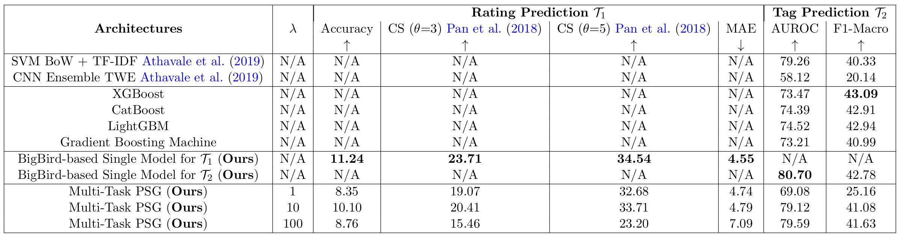
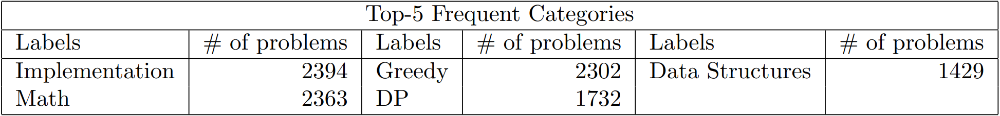
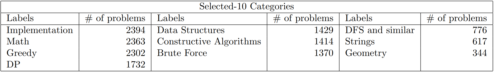
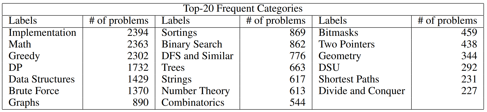
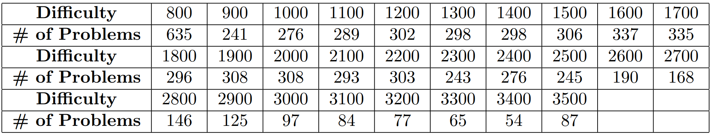
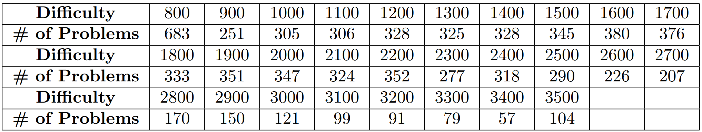
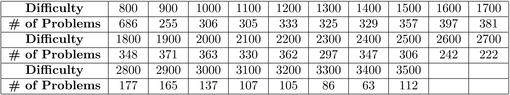

## PSG(Problem-Solving Guide) : Predicting Algorithm Tags and Difficulty

### Predicting the Algorithm Tags and Difficulty for Competitive Programming Problems

* This repository provides official PyTorch implementations for <b>Multi-Task PSG(Problem-Solving Guide)</b>.

### Authors

* [Juntae Kim](https://github.com/sronger), [Eunjung Cho](https://github.com/EunJung516), [Dongwoo Kim](https://github.com/kidw0124), [Dongbin Na](https://github.com/ndb796)

### Abstract

> The recent program development industries have required problem-solving abilities
for engineers, especially application developers. However, AI-based education
systems to help solve computer algorithm problems have not yet attracted attention,
while most big tech companies require the ability to solve algorithm problems
including Google, Meta, and Amazon. The most useful guide to solving algorithm
problems might be guessing the category (tag) of the facing problems. Therefore,
our study addresses the task of predicting the algorithm tag as a useful tool for
engineers and developers. Moreover, we also consider predicting the difficulty
levels of algorithm problems, which can be used as useful guidance to calculate the
required time to solve that problem. In this paper, we present a real-world algorithm
problem multi-task dataset, AMT, by mainly collecting problem samples from the
most famous and large competitive programming website Codeforces. To the best
of our knowledge, our proposed dataset is the most large-scale dataset for predicting
algorithm tags compared to previous studies. Moreover, our work is the first to
address predicting the difficulty levels of algorithm problems. In conclusion, we
present a deep learning-based novel method for simultaneously predicting algorithm
tags and the difficulty levels of an algorithm problem given.

### Model perfomance comparison

### Source Codes
* Our code can be run on Google Colab.
  * [Multi-Task PSG](https://colab.research.google.com/drive/1dhnU-EqRz4jI4acqUXavaYnO_oYNhct1?usp=sharing)
     * In the config, you can adjust the loss by tuning the lambda value.
  * [BigBird-based Single-Task Model](https://colab.research.google.com/drive/10Vfh_eBl6WfMA_fjQ_PcEqeIjWJbPCVB?usp=sharing)
     * In the config, you can choose 'tag' or 'rating' for the task.

### Preprocessing
* The **AMT dataset** has been processed using our preprocessing techniques.
* The technical details are as follows.
  * Substitute exponential notation.
    * 10^6 -> 1000000
  * Insert spaces between the dollar signs.
    * $$$n$$$ -> $$$ n $$$
  * Convert to lowercase.
    * This is an interactive task. -> this is an interactive task.
  * Calculate the expression. (optional)
    * 2 \cdot 100000 -> 200000
  * Remove stopwords using the nltk library.
  * Lemmatize using the nltk library.

### Datasets
* All data was collected from the [Codeforces website](https://codeforces.com/).
    * The tag distribution is as follows.
 
      * Top-5 Frequent Categories
         
         
      * Selected-10 Categories
         

      * Top-20 Frequent Categories (except constructive algorithms and *special)
         
      
    * The rating distribution is as follows.
      
       *  Top-5 Frequent Categories Difficulty distribution
          
          
       *  Selected-10 Categories Difficulty distribution
          
          
       *  Top-20 Frequent Categories Difficulty distribution
          
          

### Classification Models Performance

|Architectures|λ|Accuracy|CS (θ=3)|CS (θ=5)|MAE|AUROC|F1-Macro||
|---|---|---|---|---|---|---|---|---|
|BigBird-based Single-Task Model for Rating|N/A|10.59|**24.85**|**35.21**|5.08|N/A|N/A|([code](https://colab.research.google.com/drive/10Vfh_eBl6WfMA_fjQ_PcEqeIjWJbPCVB?usp=sharing) \| [dataset](./data/AMT10))|
|BigBird-based Single-Task Model for Tag|N/A|N/A|N/A|N/A|N/A|75.75|51.58|([code](https://colab.research.google.com/drive/10Vfh_eBl6WfMA_fjQ_PcEqeIjWJbPCVB?usp=sharing) \| [dataset](./data/AMT10))|
|Multi-Task PSG|1|**10.88**|21.60|33.26|**5.06**|61.77|36.43|([code](https://colab.research.google.com/drive/1dhnU-EqRz4jI4acqUXavaYnO_oYNhct1?usp=sharing) \| [dataset](./data/AMT10))|
|Multi-Task PSG|10|10.19|22.22|33.80|5.08|**76.37**|**51.65**|([code](https://colab.research.google.com/drive/1dhnU-EqRz4jI4acqUXavaYnO_oYNhct1?usp=sharing) \| [dataset](./data/AMT10))|
|Multi-Task PSG|100|9.10|16.82|25.39|6.80|76.32|51.33|([code](https://colab.research.google.com/drive/1dhnU-EqRz4jI4acqUXavaYnO_oYNhct1?usp=sharing) \| [dataset](./data/AMT10))|

### Citation

If this work can be useful for your research, please cite our paper:

<pre>
 @misc{kim2023problemsolving,
      title={Problem-Solving Guide: Predicting the Algorithm Tags and Difficulty for Competitive Programming Problems}, 
      author={Juntae Kim and Eunjung Cho and Dongwoo Kim and Dongbin Na},
      year={2023},
      eprint={2310.05791},
      archivePrefix={arXiv},
      primaryClass={cs.CL}
}
</pre>
